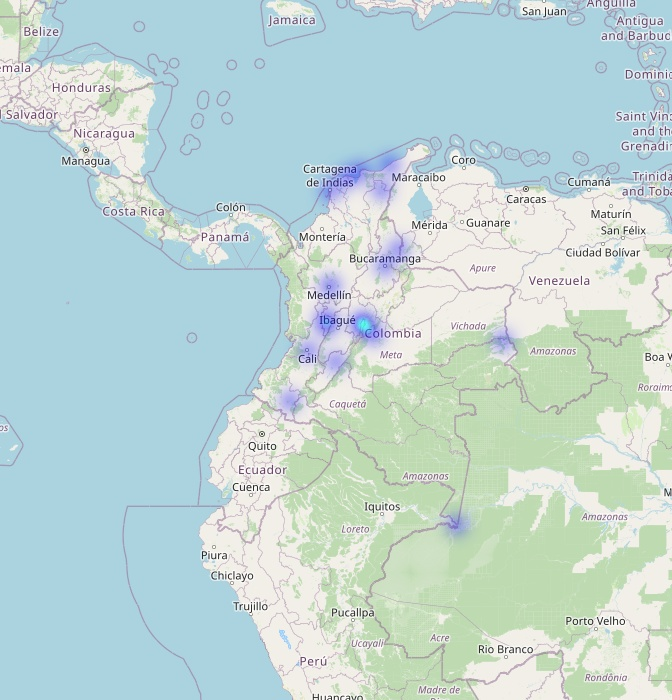

# Análisis de Rendimiento y Optimización de Activos Retail

Este proyecto presenta un análisis de datos exploratorio y geoespacial diseñado para evaluar el desempeño comercial de una cadena de cuatro tiendas minoristas en Colombia. El objetivo es proporcionar una recomendación estratégica basada en datos para la desinversión de activos (venta de la tienda con menor rendimiento).

## 1. Propósito del Análisis
El objetivo principal del desafío es asistir a la gerencia en la toma de decisiones de inversión. Se busca identificar cuál de las 4 tiendas disponibles presenta el desempeño integral más bajo y, por ende, debería ser vendida para capitalizar una nueva inversión.

La evaluación se realizó bajo un enfoque multidimensional, analizando:
* **Dimensión Financiera:** Facturación total (Ingresos brutos).
* **Dimensión Comercial:** Mezcla de productos (Product Mix) y análisis de Best/Worst Sellers.
* **Dimensión de Calidad:** Satisfacción del cliente mediante calificaciones promedio.
* **Dimensión Logística:** Eficiencia en costos de envío.
* **Dimensión Geoespacial:** Distribución territorial de las ventas (Urbanismo y alcance de mercado).

## 2. Estructura del Proyecto

El repositorio está organizado de la siguiente manera:

* `AluraStoreLatam.ipynb`: Cuaderno principal (Jupyter Notebook) que contiene la ingesta de datos, limpieza, análisis estadístico y generación de visualizaciones.
* `datasets/`: (Referencias) Los datos provienen de fuentes remotas cargadas directamente en el notebook para asegurar la reproducibilidad.

## 3. Gráficos e Insights Obtenidos

Se generaron diversas visualizaciones para sustentar la recomendación final. A continuación, se destaca el análisis territorial.

### 📍 Distribución Geoespacial de Ventas
Se mapearon las transacciones utilizando coordenadas de latitud y longitud para entender la huella operativa de cada tienda.

*(Distribución de densidad de ventas en el territorio colombiano)*

**Insight Geoespacial:**
La visualización revela una fuerte polarización de la actividad comercial. Se observa una densa concentración de ventas en los principales clústeres urbanos (Bogotá, Medellín, Cali), lo que favorece a las tiendas posicionadas en estas zonas mediante una logística eficiente.
Por el contrario, la tienda de menor rendimiento muestra una dispersión ineficiente hacia zonas periféricas (como la región amazónica), lo que correlaciona con sus altos costos de envío y menores calificaciones de satisfacción debido a las fricciones logísticas.

### Conclusión del Análisis
Basado en la integración de las variables financieras y espaciales, se recomendó la venta de la tienda con menor facturación y mayor complejidad logística, permitiendo a la gerencia optimizar su cartera de inversión.

## 4. Instrucciones para Ejecutar el Notebook

Este proyecto fue desarrollado para ser ejecutado en **Google Colab**.

1.  Abre el archivo `AluraStoreLatam.ipynb` listado en este repositorio.
2.  Haz clic en el botón "Open in Colab" (o descarga el archivo y súbelo a tu Drive).
3.  El entorno requiere las siguientes librerías (preinstaladas en Colab):
    * `pandas` (Manipulación de datos)
    * `matplotlib` y `seaborn` (Visualización estática)
    * `folium` (Mapas interactivos)
4.  Ejecuta las celdas en orden secuencial ("Run All") para reproducir el análisis y los mapas interactivos.

---
**Autor:** [Tu Nombre]
*Urbanista & Data Scientist*# Analisis-Rendimiento-Retail-LATAM
